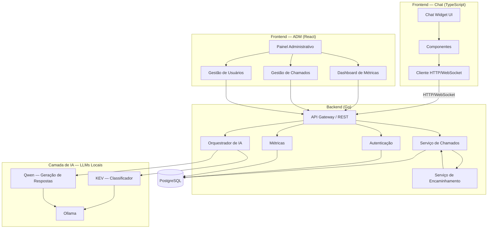

# 🤖 HelpBot

> **Atendimento inteligente e triagem automatizada de chamados de TI.**

---

## 📌 Sobre

O **HelpBot** é uma solução de atendimento interno baseada em **Inteligência Artificial**, desenvolvida para auxiliar funcionários na resolução e direcionamento de solicitações de TI.

A solução automatiza o primeiro atendimento, orientando o usuário em problemas simples e, quando necessário, coletando informações, classificando a solicitação e encaminhando o chamado para a equipe responsável.

---

## 🎯 Objetivo

Reduzir chamados simples, repetitivos ou direcionados incorretamente, tornando o suporte interno mais **rápido, organizado e eficiente**.

---

## 🏗️ Arquitetura

A arquitetura do HelpBot é dividida em **Frontend, Backend, Inteligência Artificial e Banco de Dados**.

O arquivo-fonte da arquitetura está disponível em [`arquitetura.puml`](./arquitetura.puml).

---

## 🧠 Inteligência Artificial

A camada de IA utiliza modelos locais para interpretar e responder às solicitações:

* **KEV** — classificação de intenção;
* **Qwen** — geração de respostas;
* **Ollama** — execução local dos modelos;
* **Orquestrador de IA** — integração da IA com o sistema.

---

## 🖥️ Sistema

### Chat

Interface destinada aos funcionários para realizar solicitações, receber orientações e acompanhar chamados.

### Painel Administrativo

Interface destinada ao gerenciamento de **chamados, usuários, encaminhamentos e métricas**.

---

## 🛠️ Tecnologias

| Categoria               | Tecnologia          |
| ----------------------- | ------------------- |
| Backend                 | Go                  |
| Chat                    | TypeScript          |
| Painel administrativo   | React               |
| Banco de dados          | PostgreSQL          |
| Inteligência Artificial | KEV + Qwen + Ollama |
| Comunicação             | REST + WebSocket    |
| Arquitetura             | PlantUML + Mermaid  |
| Versionamento           | Git + GitHub        |

---

## 🎨 Protótipo

O protótipo das interfaces está sendo desenvolvido no **Figma**.

---

## 👥 Equipe

| Integrante            |
| --------------------- |
| **Yuri Duarte**       |
| **Karen Marroco**     |
| **Miguel Giovannini** |
| **Cleberson Felex**   |
| **Matheus Basso**     |

---

## 📌 Status

🟡 **Em desenvolvimento**

* [x] Planejamento inicial
* [x] Definição da arquitetura
* [x] Prototipação inicial
* [ ] Validação dos requisitos
* [ ] Implementação do backend
* [ ] Implementação das interfaces
* [ ] Integração com IA
* [ ] Sistema de chamados
* [ ] Testes e validação
* [ ] Documentação final

---

## 🎓 Projeto Integrador

Projeto acadêmico desenvolvido para a disciplina de **Projeto Integrador**, aplicando conceitos de **Engenharia de Software, desenvolvimento de sistemas e Inteligência Artificial**.
