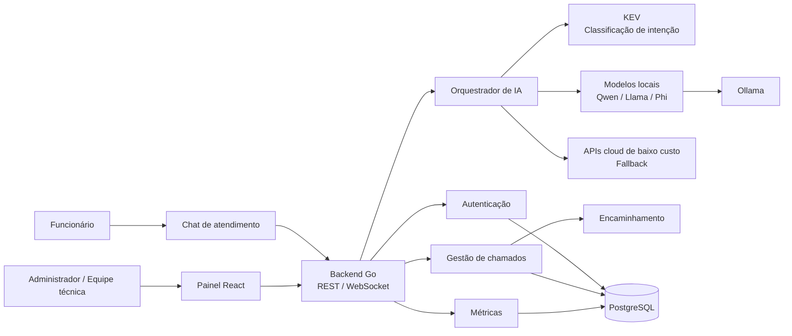
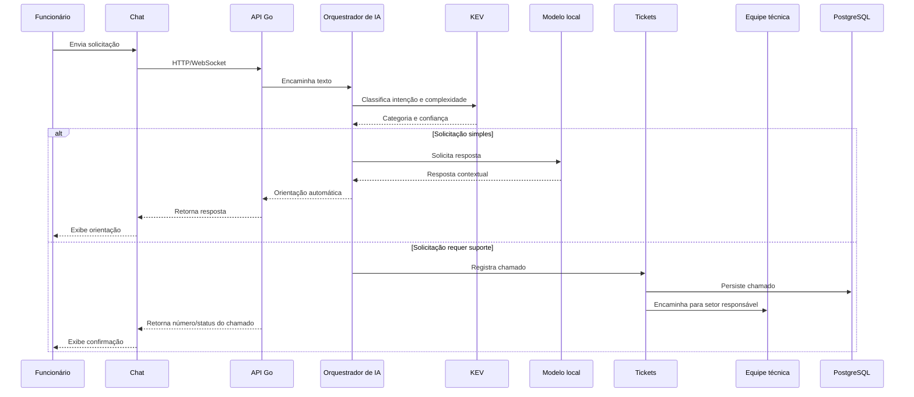
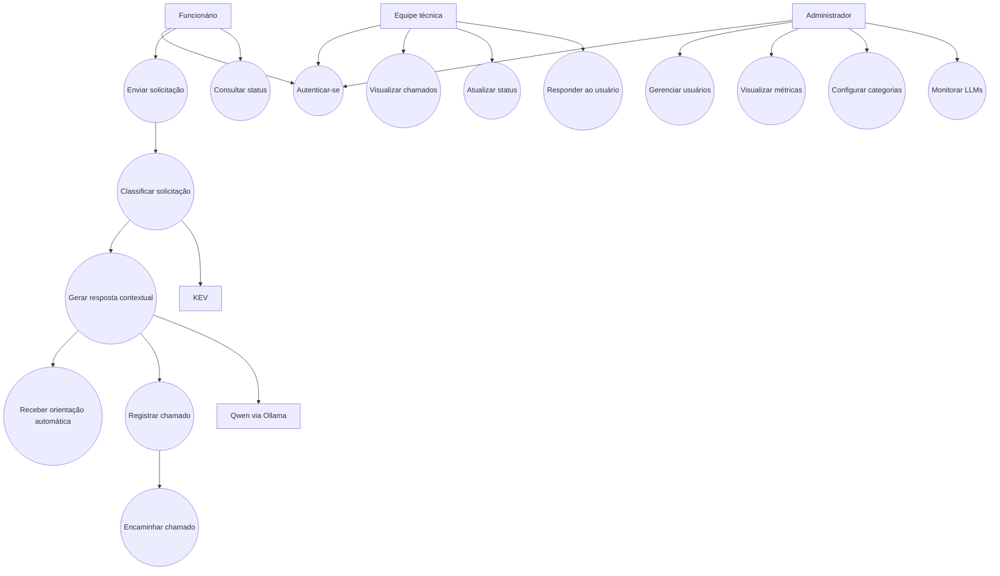
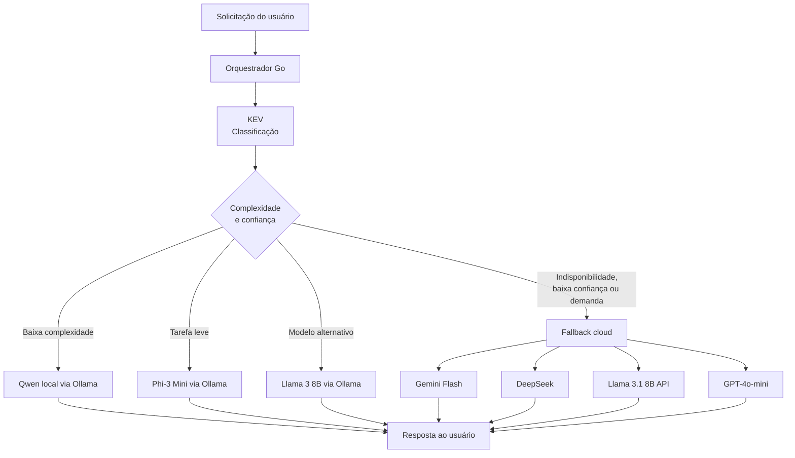

# Apresentação Executiva — OMNI

## O que é

O **OMNI** é uma proposta de plataforma interna de atendimento de TI baseada em Inteligência Artificial. O objetivo é automatizar o primeiro atendimento aos funcionários, resolver dúvidas simples, classificar solicitações, abrir chamados e encaminhá-los para a equipe responsável.

O projeto está em fase inicial de desenvolvimento. O repositório contém documentação, arquitetura e protótipos conceituais, mas ainda não possui implementação de backend, frontend, banco de dados ou integração funcional com modelos de IA.

## Objetivos de negócio

- Reduzir chamados simples e repetitivos.
- Evitar o direcionamento incorreto de solicitações.
- Automatizar o primeiro atendimento.
- Melhorar o tempo de resposta do suporte interno.
- Organizar o ciclo de vida dos chamados.
- Gerar métricas para acompanhamento da operação.
- Controlar custos usando modelos locais e fallback de baixo custo.

## Stack tecnológica

| Tecnologia | Papel no projeto | Justificativa arquitetural |
|---|---|---|
| **Go** | Backend, API e serviços internos | Adequado para APIs performáticas, concorrência, serviços independentes e processamento em tempo real. |
| **TypeScript** | Interface de chat | Adiciona tipagem ao frontend, reduzindo erros em componentes, contratos de API e mensagens. |
| **React** | Painel administrativo | Facilita dashboards, gestão de chamados, usuários, permissões e componentes reutilizáveis. |
| **PostgreSQL** | Persistência de dados | Adequado para usuários, chamados, histórico, relacionamentos e métricas estruturadas. |
| **REST** | Comunicação entre aplicações | Simples, amplamente adotado e adequado para operações de autenticação, chamados e administração. |
| **WebSocket** | Comunicação em tempo real | Permite atualizações instantâneas de mensagens e status do chamado. |
| **Ollama** | Execução local de LLMs | Reduz dependência de APIs externas, favorece privacidade e evita cobrança por token nos modelos locais. |
| **KEV** | Classificação de intenção | Identifica o tipo e a complexidade da solicitação antes da geração da resposta. |
| **Qwen** | Geração de respostas | Modelo local destinado a orientar usuários em solicitações de baixa e média complexidade. |
| **PlantUML e Mermaid** | Diagramas técnicos | Mantêm a arquitetura versionada junto à documentação do projeto. |
| **Figma** | Prototipação de interfaces | Apoia a validação visual das experiências de chat e administração. |

## Por que essa arquitetura foi escolhida

A solução separa o sistema em frontend de chat, painel administrativo, backend, camada de IA e banco de dados. Essa divisão facilita a evolução independente dos componentes, a manutenção do sistema e a substituição de modelos de IA.

A estratégia de IA prioriza modelos locais executados pelo Ollama. Essa decisão pode reduzir custos variáveis, aumentar o controle sobre dados internos e diminuir a dependência de provedores externos. APIs cloud de baixo custo são previstas como fallback para situações de indisponibilidade, sobrecarga ou baixa confiança do modelo local.

## Como o sistema funciona

1. O funcionário envia uma solicitação pelo chat.
2. O frontend envia a mensagem ao backend por REST ou WebSocket.
3. O backend encaminha o texto ao Orquestrador de IA.
4. O KEV classifica a intenção e a complexidade da solicitação.
5. O orquestrador seleciona um modelo adequado.
6. Solicitações simples recebem orientação automática.
7. Solicitações que exigem intervenção humana são registradas como chamados.
8. O chamado é encaminhado para o setor responsável.
9. O usuário acompanha o status pelo chat.
10. Métricas de atendimento, latência, modelo utilizado e encaminhamentos são registradas.

## Organização conceitual

```text
OMNI/
├── README.md
│   └── Visão geral, objetivos, tecnologias, status e arquitetura
└── diagramas/
    ├── arquitetura.md
    │   └── Arquitetura principal em Mermaid
    ├── arquitetura.puml
    │   └── Fonte PlantUML da arquitetura principal
    ├── arquitetura_llms_baratas.md
    │   └── Estratégia de modelos locais e APIs de fallback
    ├── arquitetura_llms_baratas.puml
    │   └── Fonte PlantUML da arquitetura de LLMs
    ├── usecase.md
    │   └── Casos de uso em Mermaid
    └── usecase.puml
        └── Fonte PlantUML dos casos de uso
```

## Diagrama de arquitetura



### Componentes principais

#### Frontend de chat

- Interface para o funcionário enviar solicitações.
- Componentes para mensagens, entrada de texto e status.
- Cliente HTTP/WebSocket.
- Consulta e acompanhamento de chamados.

#### Painel administrativo

- Dashboard de métricas.
- Visualização e gestão de chamados.
- Gestão de usuários e permissões.
- Configuração de categorias.
- Monitoramento dos modelos de IA.

#### Backend em Go

- API Gateway / REST.
- Serviço de autenticação.
- Serviço de chamados.
- Serviço de encaminhamento.
- Orquestrador de IA.
- Serviço de métricas.

#### Camada de IA

- **KEV:** classificação de intenção e complexidade.
- **Qwen:** geração de respostas padrão.
- **Llama e Phi:** alternativas locais.
- **APIs cloud:** fallback para indisponibilidade, baixa confiança ou alta demanda.

#### Persistência

O PostgreSQL será utilizado para armazenar usuários, dados de autenticação, chamados, encaminhamentos, histórico e métricas.

#### Processamento assíncrono

A arquitetura prevê uma fila opcional, como RabbitMQ ou Kafka, para processamento assíncrono da IA e aumento da capacidade de escala.

## Diagrama de fluxo operacional



## Diagrama de casos de uso



## Casos de uso por perfil

### Funcionário

- Autenticar-se.
- Enviar mensagem ou solicitação.
- Receber orientação automática.
- Consultar o status de chamados.

### Atendente ou equipe técnica

- Visualizar chamados abertos.
- Atualizar o status dos chamados.
- Responder ao usuário.
- Assumir ou acompanhar encaminhamentos.

### Administrador

- Gerenciar usuários e permissões.
- Visualizar métricas e relatórios.
- Configurar categorias de chamados.
- Monitorar o desempenho dos LLMs.

## Estratégia de modelos de IA



### Estratégia sugerida

1. Usar o KEV para classificar a intenção e a complexidade do chamado.
2. Encaminhar solicitações simples para o Qwen local via Ollama.
3. Utilizar Phi ou Llama localmente quando houver necessidade de menor consumo ou modelo alternativo.
4. Acionar uma API de fallback somente quando o modelo local estiver indisponível, sobrecarregado ou apresentar baixa confiança.
5. Registrar modelo utilizado, latência, custo estimado e taxa de encaminhamento.

## Status atual

O projeto está marcado como **em desenvolvimento**.

```text
[x] Planejamento inicial
[x] Definição da arquitetura
[x] Prototipação inicial

[ ] Validação dos requisitos
[ ] Implementação do backend
[ ] Implementação das interfaces
[ ] Integração com IA
[ ] Sistema de chamados
[ ] Testes e validação
[ ] Documentação final
```

## Avaliação executiva

### Pontos fortes

- Problema de negócio claro e relevante.
- Separação adequada entre chat do usuário e painel administrativo.
- Arquitetura modular com autenticação, chamados, encaminhamento, métricas e IA.
- Prioridade para modelos locais, favorecendo privacidade e controle de custos.
- Fallback cloud para aumentar resiliência e qualidade.
- Diagramas versionados junto da documentação.

### Riscos e decisões pendentes

- Backend, frontend, banco e integração de IA ainda não foram implementados.
- O KEV é citado como classificador, mas sua origem, arquitetura e modelo específico ainda não estão documentados.
- Ainda precisam ser definidos os contratos da API, o esquema do PostgreSQL e a estratégia de autenticação.
- A escolha entre RabbitMQ e Kafka permanece em aberto.
- Os critérios para selecionar modelos locais ou cloud precisam ser formalizados.
- É necessário definir políticas para dados sensíveis, logs, retenção de conversas e segurança.
- Métricas como precisão da classificação, taxa de resolução automática, latência e custo precisam ser especificadas.

## Próximos passos recomendados

1. Validar requisitos com usuários, atendentes e administradores.
2. Definir os contratos da API e o modelo de dados do PostgreSQL.
3. Criar o esqueleto do backend em Go.
4. Implementar autenticação e autorização.
5. Implementar o ciclo de vida dos chamados.
6. Criar o frontend de chat e o painel React.
7. Integrar o Ollama e o primeiro modelo local.
8. Definir critérios objetivos de fallback para APIs cloud.
9. Criar testes unitários, de integração e de avaliação da IA.
10. Implantar métricas de qualidade, latência, custo e encaminhamento.
